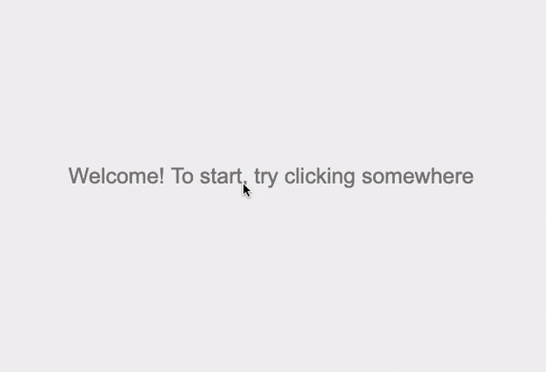

# graph-builder-game

Site: http://tranquil-oasis-04623.herokuapp.com/

Graphs, in computer science, are not like graphs in normal math, but are really more like networks. There are many tools available to analzye graphs/networks, but I found nothing online that quickly and easily allowed you to build graphs. The goal was to create a WYSIWYG tool that was intuitive and fast at building small graphs. As of July 2021, this links to the prototype version where there are "easter egg" graphs that you can discover with commentary that encourages the user while analyzing their graphs. 

# Goals / Process
There are other tools out there on the internet to build graphs, but many felt clunky and not fun. One of the biggest themes of this project was to try to create a more fun and intuitive experience, allowing the user to quickly create graphs without too much clicking and fuss. In some versions of the app, it's more for utility purposes: you can export the adjacency lists/matrices to then copy into a program. However, the Easter eggs kind of became a thing of their own and now it has a game-like feel.

I gave a little bounce to the nodes, but the real goal was to be able to make nodes with a single click--and pepper the screen with them quickly if I wanted to.

I quickly realized that when building graphs, myself and others who used the program often found it more intutitive to build the edges in sequentially as a path, rather than repeatedly adding edges radiating out from a point. Of course, which method is faster depends on the structure of the graph.

I really wanted to see what felt fun. This tool I experimented with allowed me to quickly select a whole range of nodes and connect them all at once! Very satisfying.

This tool also was interesting because it builds edges without clicking. You simply move the target area over nodes and it automatically adds edges.

# Briefly, what are graphs?
Graphs in computer science were poorly named as they're easily confused with the graphs we learn about in high school. Graphs in CS, however, are really about networks. 

Graphs are represented as a collection of "nodes" connected together. These nodes can also be called vertices, and the relationship between two nodes is called an edge. A simple example might be a family tree, where each parent node connects to their children nodes. In that example, the people are the nodes and edges represent their familial relationships. 

Technologies ranging from Google maps to protein identification to fingerprint identification are all made possibly by graphs. Graphs are fascinating becasue they can be used to model practically any situation because they essentially are about a collection of entities and the relationships between those entities.

For a more in-depth reading, checkout [wikipedia](https://en.wikipedia.org/wiki/Graph_theory) or [this nice introduction](https://medium.com/basecs/a-gentle-introduction-to-graph-theory-77969829ead8). 
