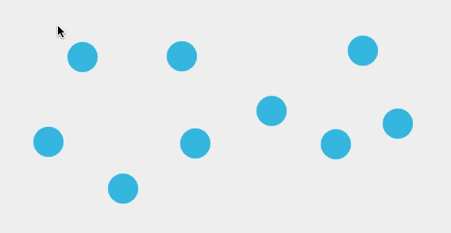
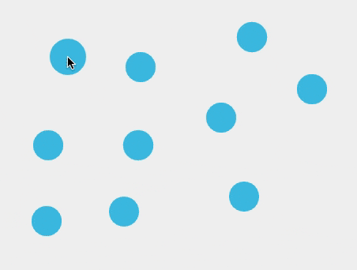

# graph-builder-game

The original "game" with Easter Eggs: http://tranquil-oasis-04623.herokuapp.com/

The tooling I'm currently developing: http://tranquil-oasis-04623.herokuapp.com/tools

FEEDBACK WELCOME!!

In computer science, networks (called graphs in CS) are used in all kinds of applications. I wanted to make a WYSIWYG (what you see is what you get) tool to build graphs. 
# GOALS:
* A WYSIWYG tool to build graphs quickly
* Make it feel fun and intuitive
* provide a way to export in a variety of formats to be implemented in code or other applications
# WHY?
* In an earlier project I was writing custom graph algorithsm. However, writing test cases out on paper was tedious and error prone. For some situations I needed graphs of 20 or 30 nodes with dozens of edges, and when test cases failed it was hard to tell if the issue was my algorithms or because I had constructed the graph incorrectly.
* I want to make it easier to quickly build small to medium size graphs.
# NOT-GOALS:
 ("you have to say 'no' to 90% of feature ideas")
* Graph analysis - there are many, many tools available out there that take graph data and can analyze the heck out of it. I'm not trying to reinvent all of graph theory here. The goal with this app is to help you construct a graph visually and then you can export it to be analyzed or used however you want later
* Creating pretty pictures - [Graph drawing](https://en.wikipedia.org/wiki/Graph_drawing) is a fascinating field, and I'm very tempted to build more ways to move or customize the appearance of the graph...but feature bloat is real and there are tools out there that do this well: (1) there are many [tools](https://neo4j.com/developer/tools-graph-visualization/) that, given the raw graph data, can visualize the graph. The issue is that they are fiddly and not WYSIWYG (2) I don't have time to reinvent all of Adobe Illustrator :( Actual art tools like Figma/Illustrator/many others help you draw pretty diagrams or other vector based art and we don't need to entirely reinvent that wheel. 

# What Tools
I've been trying lots of different tool types (see below), and these are my findings:
* What tool is best really depends on what kind of graph you're building (sparsely connected, nearly complete, a tree, etc.)
* Fewer, less "efficient" tools are better than too many tools: feature bloat is dangerous, not just because users get confused but it also multiplies all the interactions and tech debt you have to deal with.

# Tool Examples
I gave a little bounce to the nodes, but the real goal was to be able to make nodes with a single click--and pepper the screen with them quickly if I wanted to.

I quickly realized that when building graphs, myself and others who used the program often found it more intutitive to build the edges in sequentially as a path, rather than repeatedly adding edges radiating out from a point. Of course, which method is faster depends on the structure of the graph.

I really wanted to see what felt fun. This tool I experimented with allowed me to quickly select a whole range of nodes and connect them all at once! Very satisfying.

This tool also was interesting because it builds edges without clicking. You simply move the target area over nodes and it automatically adds edges.

# Wait, these aren't graphs...
For those unfamiliar with the term, the term "graph" in computer science really refers to networks, which is confusing. These networks are a collection of "nodes" (also called "vertices") connected together. A connection between two nodes is called an "edge".

Technologies ranging from Google maps, to molecular analysis, to fingerprint identification are all made possibly by graphs. Graphs are fascinating becasue they can be used to model practically any situation because they essentially are about a collection of entities and the relationships between those entities.

For a more in-depth reading, checkout [wikipedia](https://en.wikipedia.org/wiki/Graph_theory) or [this nice introduction](https://medium.com/basecs/a-gentle-introduction-to-graph-theory-77969829ead8). 
